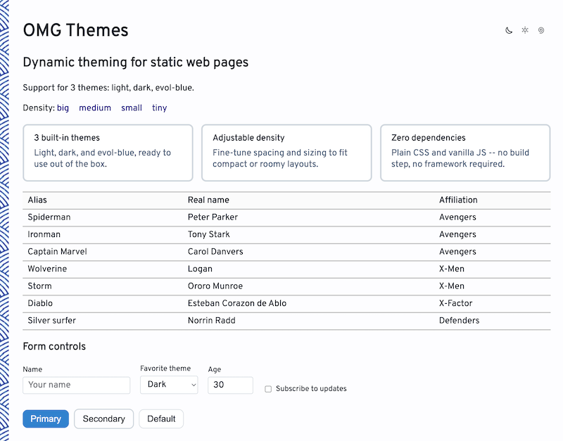
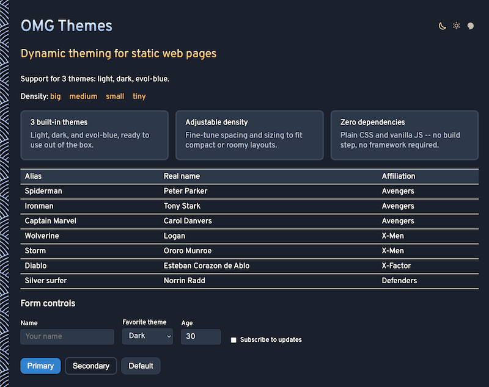
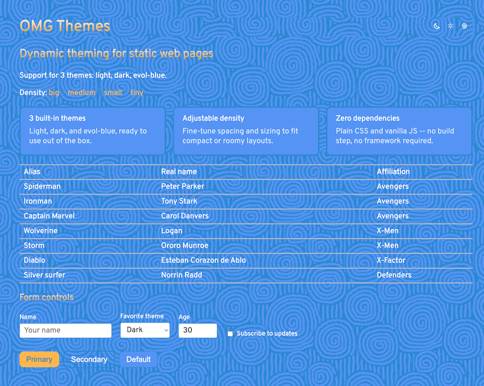

# OMG-Themes

Multiple themes for OMG Brand.

3 themes: Light, Dark, Blue





## Using the themes in a project

Projects ([tarot-reading](https://github.com/evoluteur/tarot-reading), [mandala-maker](https://github.com/evoluteur/mandala-maker)) keep their own copy of the shared files: `css/core.css`, `css/densities.css`, `css/themes/*` and `js/omg.js`. Don't edit the copies. Instead:

- Run `npm run sync:themes` in the project to refresh them from this repo (`scripts/sync-omg-themes.sh`, expects `omg-themes` next to the project or its path as argument).
- Put project-specific tweaks in the project's `css/overrides.css`, loaded right after the density stylesheet. `setTheme` in `omg.js` sets `data-theme` on `<html>`, so per-theme rules can be written as `:where(html[data-theme="dark"]) a { ... }` (`:where` keeps the specificity low, like the theme files, so the project's own stylesheets can still override them).
- Fix or improve anything shared here, then sync.

### Linking instead of copying

A project can also load everything straight from the hosted copy (no sync step, always up to date), as [healing-frequencies](https://github.com/evoluteur/healing-frequencies) does. Set the base URL before loading `omg.js` (the same-origin GitHub Pages hosting means no CORS issue):

```html
<script>
  window.OMG_THEMES_BASE = "https://evoluteur.github.io/omg-themes/";
  window.OMG_DEFAULT_THEME = "evol-blue"; // optional, defaults to "dark"
</script>
<link id="omg-core-css" rel="stylesheet" href="https://evoluteur.github.io/omg-themes/css/core.css" />
<link id="omg-theme-css" rel="stylesheet" />
<script src="https://evoluteur.github.io/omg-themes/js/omg.js"></script>
```

Then add `<div id="omg-theme-picker"></div>` and call `setupPage()` on load. Project styles loaded after the theme link can use `html[data-theme="dark"]` etc. Trade-offs: needs network (also on localhost), and a PWA's first offline visit won't have the theme files until they have been cached once.

(c) 2026 [Olivier Giulieri](https://evoluteur.github.io/).
